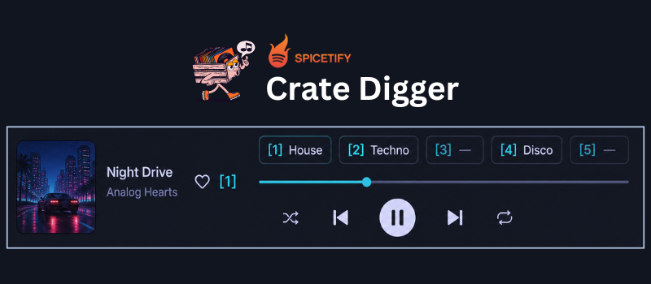

# Crate Digger

[Spicetify](https://spicetify.app) extension for keyboard-first crate digging: hear a track, dump it into a bound playlist, keep moving.

- Number keys `1`–`9` / `0` add the current track to that slot
- HUD above the seek bar shows `[1] playlist  [2] playlist  …`
- Slot numbers appear next to Like when the track is already in a crate
- Optional **Like cleaner**: unlike after sorting a liked track
- **Enabled** toggle in settings: park keys/HUD without uninstalling

[](banner.png)

## About

As a Spotify user who's obsessed with curating playlists and exploring music, I knew this experience could be drastically improved. Typically when I am "crate digging", it goes something like: find song → radio it → enter rabbit hole → find some playlist or new sub genre → quickly listen to hundreds of songs at 5–10 seconds each → possibly like/add to playlist → repeat. The problem with this workflow however is that it's quite slow due to Spotify UI performance and the simple fact of having to use a GUI period. As a Linux window manager/terminal heavy person, this extension was the answer. Now, I can associate up to 9 playlists with keybinds, rapidly add songs to those playlists and continue digging without ever lifting my fingers.

## Install

### Marketplace

Install [Spicetify Marketplace](https://github.com/spicetify/marketplace), then search for **Crate Digger**.

### Manual

Copy `cratedigger.js` into your Spicetify extensions directory:

| Platform | Path |
| -------- | ---- |
| Linux | `~/.config/spicetify/Extensions` |
| macOS | `~/.config/spicetify/Extensions` |
| Windows | `%appdata%\spicetify\Extensions\` |

```bash
spicetify config extensions cratedigger.js
spicetify apply
```

Then fully quit and relaunch Spotify.

### Nix (spicetify-nix)

```nix
programs.spicetify.enabledExtensions = [
  {
    src = pkgs.fetchFromGitHub {
      owner = "kzndotsh";
      repo = "spicetify-cratedigger";
      rev = "<commit>";
      hash = "";
    };
    name = "cratedigger.js";
  }
];
```

## Keys

Ignored while typing in an input / textarea / select.

| Key | Action |
| --- | ------ |
| `1`–`9`, `0` | Add current track to that slot. Stay. |
| `Shift+digit` | Add, then skip to next. |
| `A` / `D` | Previous / next track |
| `L` | Toggle like |

Unbound slot or no track → error toast, no skip.

## Settings

Profile menu → **Crate Digger**. Bind a writable playlist per key. Saved per Spotify account in LocalStorage.

**Enabled** (on by default): keys, HUD, and crate tags. Uncheck to park the extension; the profile menu stays so you can turn it back on.

**Like cleaner** (off by default): after a successful sort into a playlist, unlike the track if it was in Liked Songs.

Click a HUD chip to open settings. The chip flashes when you dump a track into that slot.

## License

MIT
